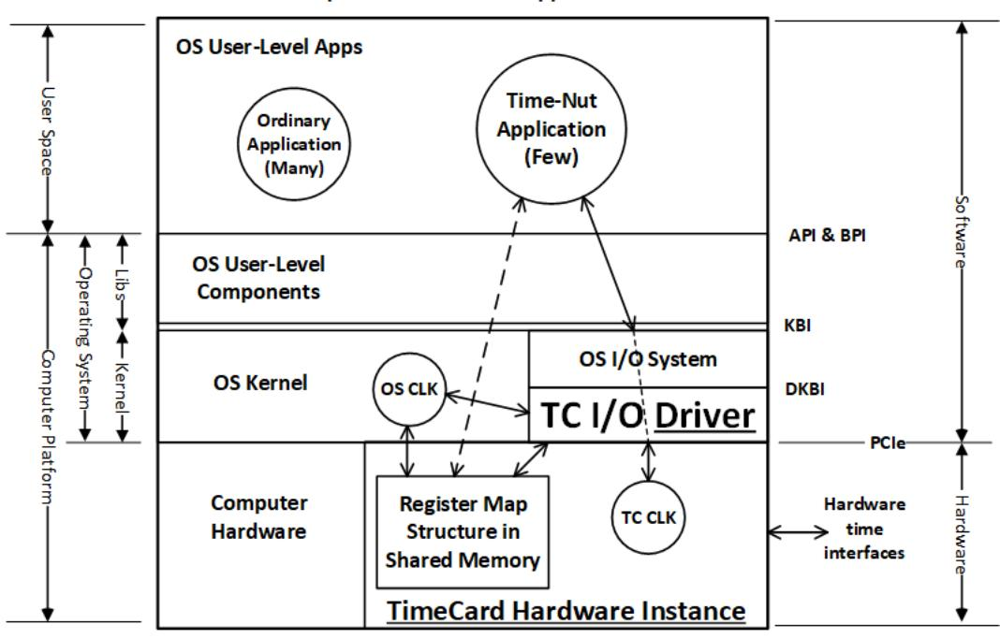

# A TimeCard Driver's World

*Author:* J.M. Gwinn

## 1 Background

I became an embedded real-time programmer in the late 1970s when Assembly Code was considered a high-level language. This was a big advance over programming directly in machine code, but even after the transition to assembly code, everything ran on the bare iron with no operating system. A big advantage of assembly code over machine code was that assembly code automated a lot of bookkeeping and had macros, which allowed the generation of often-reused code without having to manually code each instance.

The transition from assembly language to high-level languages like Fortran and ANSI C and the use of real-time operating systems all came later. The ancient history prolog is that the computer platform structure explained below originated in DEC VAX/VMS, which begat Microsoft's Windows NT, both of which inspired POSIX/LINUX. I don't miss those days, but their history helps a lot with understanding today, despite the immense (about a factor of 10^11 to one) increase in computation speeds.

The internal structure of operating systems is quite unlike that of application code; these are very different worlds, and the rules of one do not apply in the slightest to the other.

## 2 Analysis

There seems to be a general unspoken assumption that I/O drivers, such as the TimeCard (TC) driver, must themselves provide some kind of user-level API that allows direct access to the TC Driver. This is not true.

The figure (*A TimeCard Driver's World*) shows where the TimeCard hardware and I/O driver are located in a Computer Platform. The TC I/O Driver is an integral part of the OS Kernel. Timecard hardware is buried deep in the platform's computational hardware, inaccessible to the application software, including bespoke applications intended for timekeeping duties. Access is only via the OS's I/O System unless a shared-memory window (POSIX SMO or TMO) has been opened, allowing direct access (denoted by the dashed double-headed arrow) by user-space applications to the TC Register Map. The figure provides some context.[^1] The basic question to be answered here is how fast these various entities and their interfaces evolve, and we will work our way down from top to bottom addressing this as we go.

The OS User-Level Apps mostly use standardized APIs like POSIX (IEEE 1003.1), which APIs change quite slowly. For stability of the immense existing operating-system codebase, the POSIX standard changes no faster than once every five years. Code written to these APIs must be compiled and linked to the relevant OS User-Level Components (mostly app libraries) to yield executable binaries. These binaries implement the then-current BPIs to talk to the OS Kernel. These BPIs change slowly but steadily because the OS User-Level Apps need only be recompiled and re-linked to match the new BPI. Operating systems will have at least one major version per year, and more often when new and/or problems emerge.

The OS User-Level Components layer is quite complex, containing multiple kernel libraries and runtime systems, including those supporting interpreted languages. It requires a doorstop tome to adequately describe this layer.

The TC I/O Driver interface is written to the then-current DKBI, which often changes with each major operating system version.

The TC I/O Driver also changes when the TimeCard hardware changes, such as when the TC is upgraded within a model line and/or when a different make and model of TC is installed.

I/O Drivers are in general tied very tightly both to the hardware being controlled and to the implementation details of the OS in question, so there is a version per OS make, model, and version; these things evolve rapidly and drivers are never interchangeable unless someone went to considerable sustained trouble to ensure continuity. The total number of I/O drivers needed is the Cartesian Product[^2] of hardware versions by OS versions. Maintaining this continuity is expensive, so absent a market drive it soon fades. In practice, what often paces the release rate of new operating system major versions is getting all the I/O drivers fully updated, integrated, and regression-tested. And fixing the inevitable escapes.

In the figure, the boundary between Hardware and Software is the PCIe bus interface, which does *not* support hot swapping, and physical damage may result if hot swapping is attempted. The PCIe interface is thus strictly static, as devices cannot appear and disappear at random. Of the present TC interfaces, only USB interfaces support hot insertion and removal and thus can (but need not) be dynamic.

The Register Map Structure in shared memory (either SMO or TMO) changes only as fast as the TC hardware changes, and if this structure is governed by the P3335 standard to come, the change rate will be far slower. It's OK if each TC implementation has its own flavor of Register Map, because the software to access a Register Map is necessarily tied to the details of that Register Map. It's typical to have one part of a Register Map governed by a standard (and thus the same everywhere) and another part vendor-defined (and thus varies).

Often suggested in one form or another is that the Register Map should be defined only by a Data Model (or equivalent). In the TC context, what exactly is a *Data Model*? This term has many definitions, but most are too grandiose for a TC. The most appropriate formal definition found so far is that used by Synopsys[^3] in Electronic Design Automation (EDA): "The term 'common data model' is used in many aspects of software engineering. At a high level, software systems can be thought of as having two parts: The algorithms that operate on data and the logical infrastructure where the data is stored. A common data model aims to standardize that logical infrastructure so that many related applications can operate on and share the same data."

A Register Map definition is an IDD[^4] (bits are locked down), while a Data Model is a kind of IRS[^5] (only required kinds of data is defined). The problem with specifying only an IRS is that the interoperability of TC makes and models is thereby defeated.

_Conclusion: Only a register map structure as defined in an IDD can be stable enough to be plausible for normative use in an IEEE TC hardware standard._

## 3 Notes
Started on 27 September 2024 after a week or two of mulling.

## 4 Acronyms

**ANSI** = American National Standards Institute
**API** = Application-Program I/F
**BPI** = Binary-Program I/F
**CLK** = Clock
**DEC** = Digital Equipment Corporation
**DKBI** = Driver-Kernel Binary I/F
**EDA** = Electronic Design Automation
**IDD** = Interface Design Document
**I/F** = Interface
**I/O** = Input/Output
**IRS** = Interface Requirements Specification
**Libs** = Libraries (usually including runtime systems)
**OS** = Operating System
**PCIe** = Peripheral Component Interconnect Express
**PTP** = Precision Time Protocol (IEEE 1588)
**SMO** = Shared Memory Object (POSIX)
**TC** = TimeCard
**TMO** = Typed Memory Object (POSIX)
**USB** = Universal Serial Bus

[^1]:  This applies to essentially all present-day POSIX/Linux platforms, including the "PTP hardware clock infrastructure for Linux" < https://www.kernel.org/doc/html/latest/driver-api/ptp.html >.

[^2]: < https://en.wikipedia.org/wiki/Cartesian\_product >

[^3]:  < https://www.synopsys.com/glossary/what-is-common-data-model.html >

[^4]:  [IDD\_DID] DI-IPSC-81436A, "Interface Design Description – Data Item Description", approved 1999-12- 15, 6 pages. This defines the exact format – what every bit means and where it is located.

[^5]:  [IRS\_DID] DI-IPSC-81434A, "Interface Requirements Specification – Data Item Description", approved 1999-12-15, 20 pages. This defines the kinds of data that are required, but leaves their detailed format to design.
