# Slide 1

## The Linux Kernel DPLL SubsystemHugo Ongetta-Dagnoni

NEX

---

# Slide 2

Provides a general interface to configure devices that use DPLLs (Digital Phase Locked Loops)

Utilises an underlying Netlink protocol to receive & request changes to a DPLL’s configuration information 

An alternative to the sysfs interface

## Introduction to the API

NEX

---

# Slide 3

First introduced in version 6.7 and continuously updated to provide more capabilities
Available at kernel.org & on RHEL 9.4, CentOS Stream 9, OCP 4.14

Further patches are expected by end of year

It’s strongly suggested to use latest available kernel release

## History & Development

NEX

---

# Slide 4

The sysfs interface was designed to be used as an out-of-tree solution with Intel proprietary configuration options.

New API was created to be used upstream & industry-wide and was later backported
New patches can be submitted according to community needs

Support for sysfs will continue
With support eventually ending

## Transitioning from the sysfs Interface

NEX

---

# Slide 5

Uses a general purpose YNL utility to encode & decode netlink messages

Bases these messages on a DPLL YAML specification passed in as a parameter

Can then pass in request to dump/edit info with --dump & --do flags

Boilerplate for using API

## How does it work?

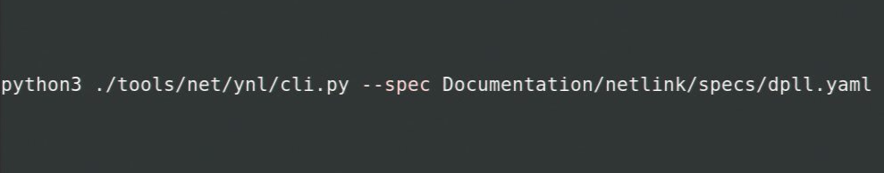

NEX

---

# Slide 6

Retrieve information on all DPLL devices with netlink command device-get & --dump flag:
	./tools/net/ynl/cli.py --spec Documentation/netlink/specs/dpll.yaml --dump device-get

## --dump device-get

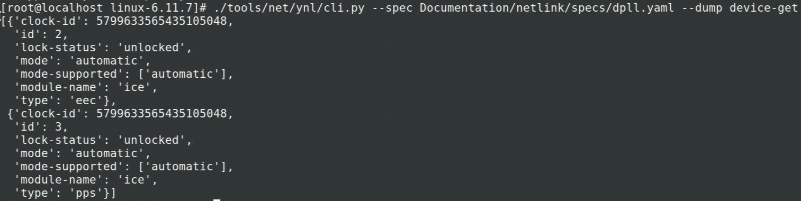

Example Command Output

NEX

---

# Slide 7

Retrieve information on a specific DPLL device with netlink command device-get & --do flag:
	./tools/net/ynl/cli.py --spec Documentation/netlink/specs/dpll.yaml --do device-get --json 	‘{“id”:<id>}’
	where: 	<id> = id of DPLL of interest

## --do device-get

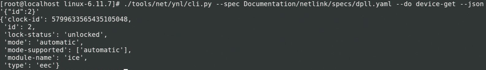

Example Command Output

NEX

---

# Slide 8

Retrieve information on all DPLL pins with netlink command         pin-get & --dump flag:
	./tools/net/ynl/cli.py --spec Documentation/netlink/specs/dpll.yaml --dump pin-get

## --dump pin-get

Command Output

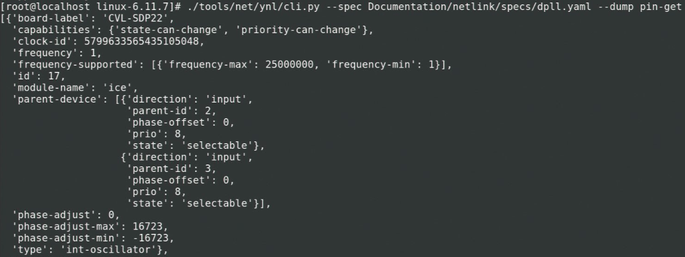

Snippet of Example Command Output

NEX

---

# Slide 9

Retrieve information on a specific DPLL pin with netlink command pin-get & --do flag:
	./tools/net/ynl/cli.py --spec Documentation/netlink/specs/dpll.yaml --do pin-get --json 	‘{“id”:<id>}’
	where: 	<id> = id of pin of interest

## --do pin-get

Example Command Output

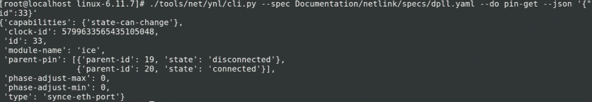

NEX

---

# Slide 10

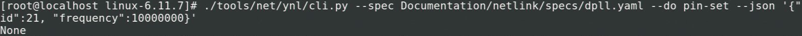

Modify a pin’s attributes with netlink command pin-set & --do flag:
	./tools/net/ynl/cli.py --spec Documentation/netlink/specs/dpll.yaml --do pin-set --json 	‘{“id”:<id>, “<attr>”: “<value>”}’
	where: 	<id> = id of pin of interest
		<attr> = attribute to be modified, 
		<value> = value to assign to 	attribute

## --do pin-set

Example Command Output

NEX

---

# Slide 11

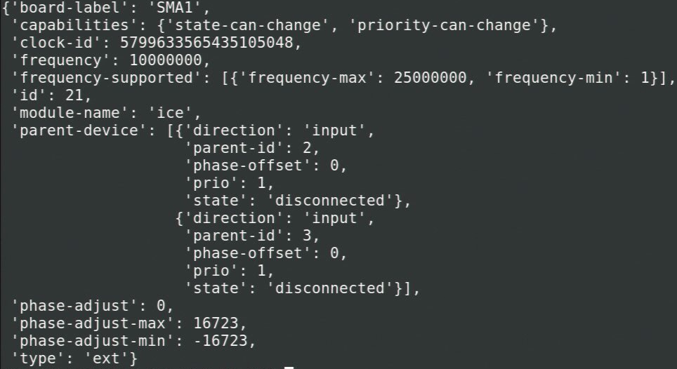

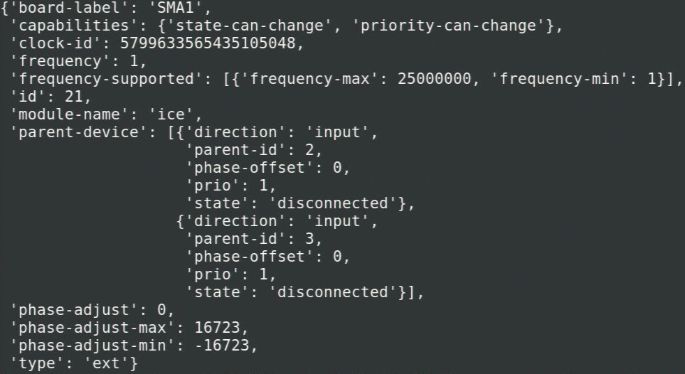

## --do pin-set

Before Command

After Command

NEX

---

# Slide 12

Modify a pin’s attributes on their directly connected DPLL(s) with netlink command pin-set & --do flag: 
	./tools/net/ynl/cli.py --spec Documentation/netlink/specs/dpll.yaml --do pin-set --json 	‘{“id”:<id>, “parent-device”: {“parent-id”:<p_id>, “<attr>”:”<value>”}}’
	where: 	<id> = id of pin of interest,
		<p_id> = id of parent DPLL,
		<attr> = attribute to be modified, 
		<value> = value to assign to 	attribute

## --do pin-set on Parent DPLL

Example Command Output

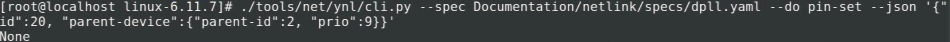

NEX

---

# Slide 13

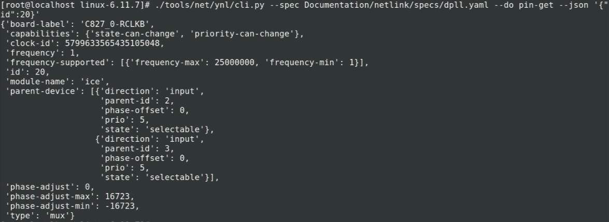

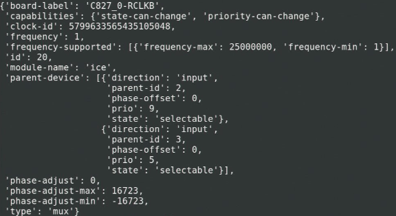

## --do pin-set on Parent DPLL

Before Command

After Command

NEX

---

# Slide 14

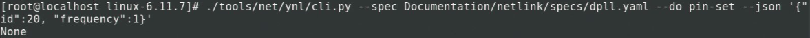

Modify a child pin’s attributes on their parent pin with netlink command pin-set & --do flag: 
	./tools/net/ynl/cli.py --spec Documentation/netlink/specs/dpll.yaml --do pin-set --json 	‘{“id”:<id>, “parent-pin”: {“parent-id”:<p_id>, “<attr>”:”<value>”}}’
	where: 	<id> = id of pin of interest
		<p_id> = id of parent pin
		<attr> = attribute to be modified, 
		<value> = value to assign to 	attribute

## --do pin-set on Parent Pin

Example Command Output

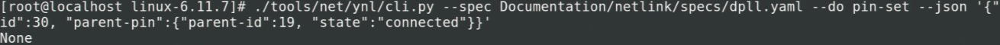

NEX

---

# Slide 15

## --do pin-set on Parent Pin

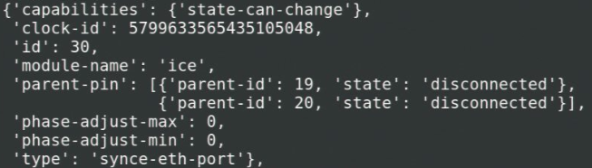

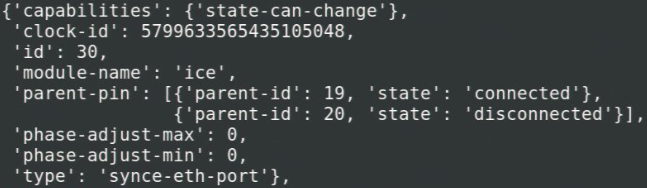

Before Command

After Command

NEX

---

# Slide 16

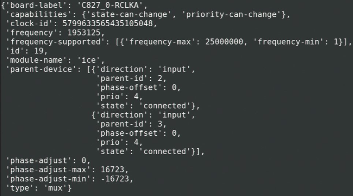

## --do pin-set on Parent Pin

Output after pin-get

NEX

---

# Slide 17

Concatenate multiple --do operations with --multi flag: 
	./tools/net/ynl/cli.py --spec Documentation/netlink/specs/dpll.yaml --multi <do_operation> --multi 	<do_operation> … 
	where: 	<do_operation> = operation that would be encapsulated with a --do flag. 
				E.g. pin-get ‘{“id”:20}’

## --multi flag

Example Command

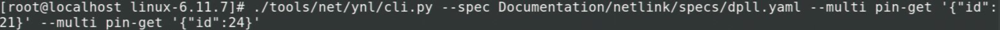

NEX

---

# Slide 18

## --multi flag

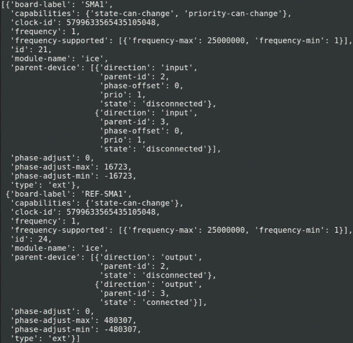

Example Command Output

NEX

---

# Slide 19

## Live Demonstration

NEX

---

# Slide 20

## Thank you Any questions?

With Special Thanks to 
Arkadiusz Kubalewski, Zoli Fodor, Przemek Korba & Stephen P Mroczek

NEX

---
