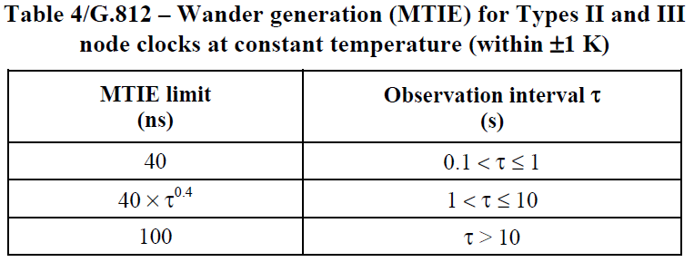
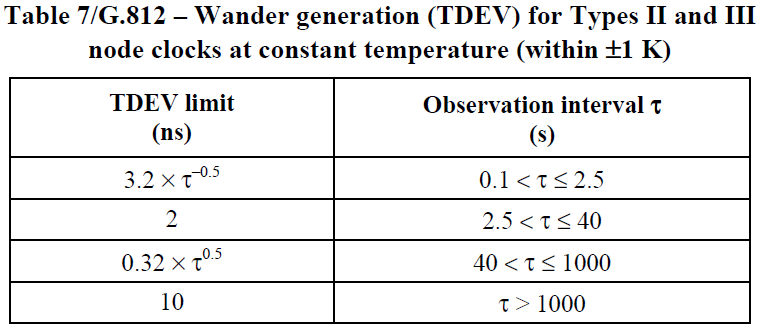
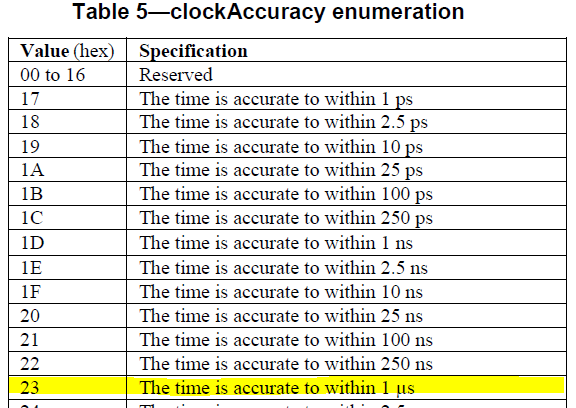

# Slide 1

Metrics: Time & Frequency Accuracy
Minimum Accuracy

December 12, 2023
Greg Armstrong
Renesas Electronics Corporation

---

# Slide 2

## Time & Frequency AccuracyMinimum Frequency Accuracy

Highly recommend to follow ITU-T clock recommendations, specifically ITU-T G.812
G.812 provides metric and targets for frequency accuracy, noise generation, noise tolerance and noise transfer
Can also be used for hold-over performance
For minimum frequency accuracy, recommend using Type III – also maps to OCP-TAP oscillator minimum recommendations
Frequency accuracy: 4.6 × 10–6 (1 year)
Noise Generation (recommend using both MTIE & TDEV for metrics)

For noise transfer, recommend using a bandwidth of 0.001 Hz and maximum gain peaking of 0.2 dB
Again, allows reuse of metrics and performance targets from G.812
Existing test equipment that can be used to measure – may place requirements at faceplate for measurement output (i.e. SMA (10MHz), ETH (SyncE), …)

---

# Slide 3

## Time & Frequency AccuracyMinimum Time Accuracy

The OCP-TAP Oscillator Workstream defined a Class G1 Oscillator Normative Specifications
Target was to provide minimum 250ns (when locked to GNSS)
Recommend to follow IEEE 1588-2019 clockAccuracy for reporting accuracy
Recommend following ITU-T for time accuracy metrics
For minimum time accuracy:
When locked to GNSS input source, recommend using wander generation from G.8272 but extending MTIE to 250 ns (i.e. OCP-TAP target)
Minimum time accuracy would be 0x22 (meaning accuracy range of 100 ns ~ 250 ns)


When locked to non-GNSS time sources, recommend using metric max|TE| (like ITU-T G.8273.x recommendations)
Minimum time accuracy would be 0x23 (meaning accuracy range of 250 ns ~ 1 μs)
Recommend defining max|TE| of 1 μs as a minimum
Metrics may want to also look at sub-components, cTE and dTE
Again, there is existing test equipment that can be used to measure max|TE|, cTE, dTE

---

# Slide 4

Renesas.com

---
