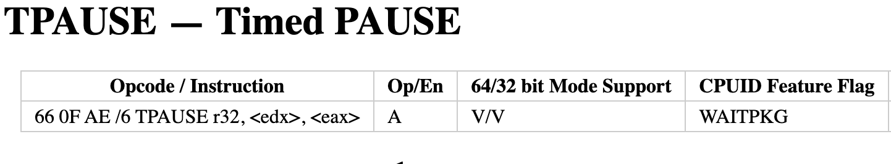
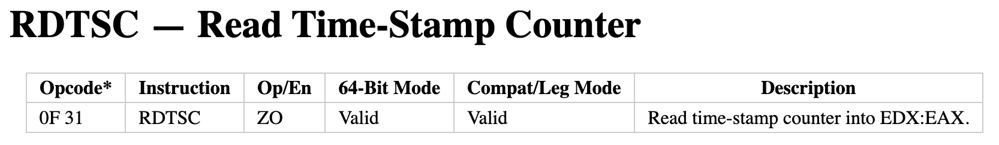
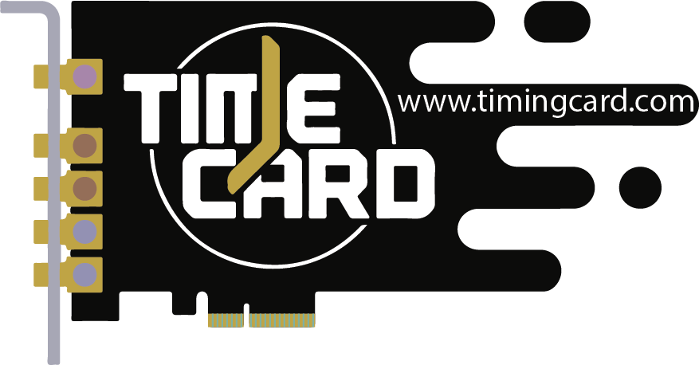
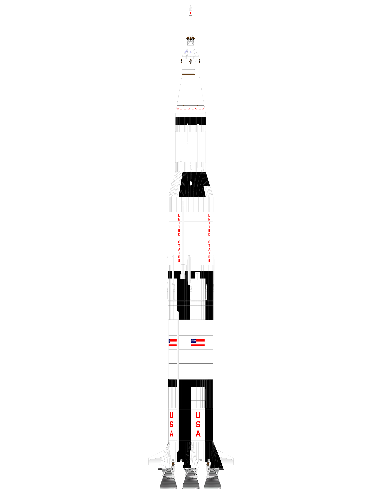
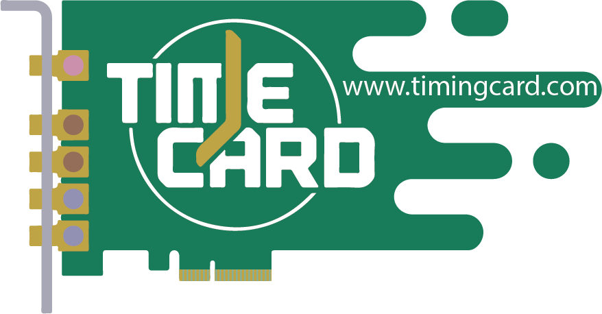
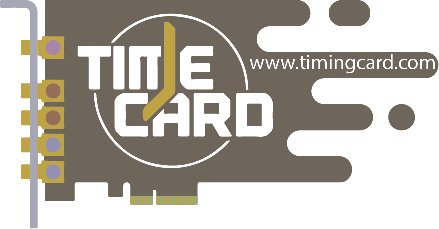
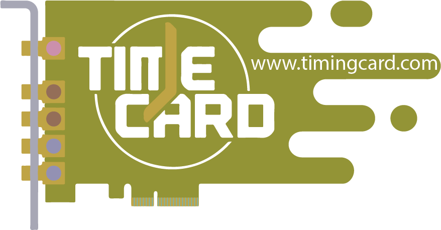

# Slide 1

## P3335

Standard for Architecture and Interfaces for Time Card

---

# Slide 2

---

# Slide 3

Data Center

PTM & PFM

IEEE P3335

IEEE 1588

RDTSC

TPAUSE

CPU’s
TSC

SPTP

---

# Slide 4

## Time Keeping and Time Dissemination

Launch Vehicle:
NTP
PTP
WR
PPS
None
Payload
Time Card (Time)

---

# Slide 5

## Open Compute Project’s Time Card 2

Dual GNSS PCIe card with a MAC

PCIe

SMA

GNSS1

GNSS2

Time Engine

MAC

---

# Slide 6

## Time Card Concept

All possible pathways

PCIe

SMA

GNSS1

GNSS2

Time Engine

MAC

---

# Slide 7

## Time Card Concept

All possible pathways

PCIe

SMA

GNSS1

GNSS2

Time Engine

MAC

1

2

3

4

5

---

# Slide 8

## High Level Structure

Data/Sync Directions

Time Engine

Local Oscillator

Physical Interface

Host Interface

Receiver

---

# Slide 9

## Focus Areas

Time Engine

Local Oscillator

Physical Interface

Host Interface

Receiver

1

2

3

4

5

7

6

Metrics and Performance

---

# Slide 10

## Proposed Approach

We already have something that works (various Time Cards)
Turn the Time Card to a general case
Study the general case
Dissect the work in subgroups (Diverge)
Work in parallel
Bring things together (Converge)
Combing through the work (coherence)

Goal: Embrace Diversity, Ensure Interoperability

---
